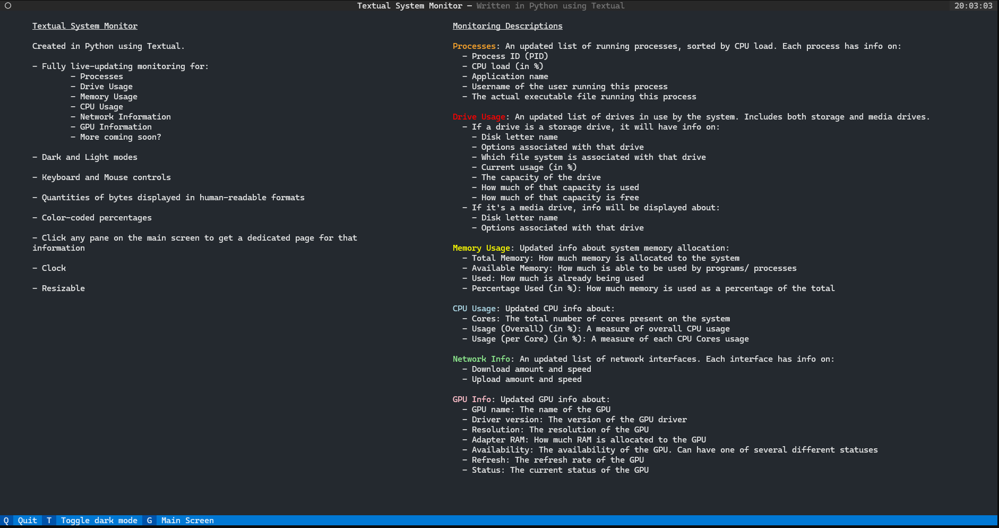

# Examples 

This guide will show an overview of the screens of the app and what you can do with them.

# Header

The Header is persistent on all screens. It shows the title of the app and a clock in 24-hours format.

In the middle is the title. On the right is the 24-hour clock. On the left is a circle representing the command palette.
The command palette is not currently well-developed, only having bare-bones, default functionality.

# Footer

The Footer is persistent on all screens. The Footer changes for each screen you're on depending on what
actions you can perform on that screen.

This is the Footer for the Main screen. It shows that you can hit the `Q` key to quit, the `G` key to enter the Guide 
screen, etc. The Footer changes what keys are available for each screen.

Not only does the Footer show what keys you can press, but these are also clickable buttons that do the same thing
as pressing their corresponding keys.

# Main Screen

The above is the Main screen. This is the default screen when the app starts. All system stats are visible here.

On the left are currently active Processes. On the right are Drive, Memory, CPU, Network, and GPU stats.

Each of these panes is clickable to reach a dedicated screen for that stat. In addition, the keys displayed on the Footer
also navigate to and from those dedicated screens.

As the screen gets too small to display all information, the individual panes will show scroll bars as necessary.

# Guide

When pressing the `G` key (only accessible from the Main screen), the in-app Guide screen appears:

This screen displays overall information about the app on the left and descriptions of what information the app tracks
on the right.

As you can see from the Footer, there is less you can do from the Guide screen than the Main screen.

# Processes

When clicking the Processes pane or pressing the corresponding `p` key, the following dedicated screen appears:

This shows a nice table view of running processes. While the Processes pane on the Main screen showed only the top 10
heaviest processes, this dedicated Processes screen shows all running processes (again, in order of CPU load).

This screen also has a `Sorted` button, which toggles whether the processes are sorted by CPU load.
The `Pause` button toggles whether to pause updating the list or not.

# Drives

When clicking the Drives pane on the Main screen, or pressing the `d` key, the Drives screen appears:

This also shows a nice table view of currently mounted storage and media drives.

# Memory

When clicking the Memory pane on the Main screen, or pressing the `m` key, the Memory screen appears:

This shows an admittedly sparse view of the same information shown on the Main screen. I haven't figured out how to
display this nicely yet.

# CPU

When clicking the CPU pane on the Main screen, or pressing the `c` key, the CPU screen appears:

On the left is the overall CPU information, including number of cores and overall CPU load.
On the right is a table of the per-core CPU load breakdown.

# Network

When clicking the Network pane on the Main screen, or pressing the `n` key, the Network screen appears:

This shows a table view of the same information present on the Main screen.

# GPU

When clicking the GPU pane on the Main screen, or pressing the `v` (for video) key, the GPU screen appears.

This screen is threadbare for now.
