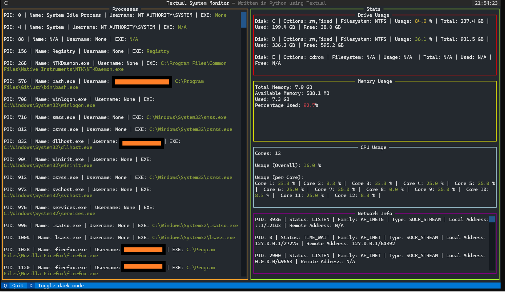

# Textual System Monitor

This is intended to be a simple system monitor app created in Python, using Textual.

It is only guaranteed to work in Windows. There are currently no plans to offer support for other 
operating systems, as different OSes have different low-level APIs for system information.

This is a preliminary design, for now.



**Note**: Personal info has been censored, the orange bars are not present in the real app.

# Features

- Some of the information shown in this app live-updates a few times a second. Eventually, I wish for all information
to live-update.

- Percentages (indicating load) are color-coordinated according to certain thresholds.
High percentages are <span style="color: red;">red</span>, medium percentages are
<span style="color: yellow;">yellow</span>, and low percentages are <span style="color: green;">green</span>.

- Quantities of bytes are automatically shown in human-readable formats, such as KB and GB.

- If the window is too small, all panes have vertical scroll bars, such as the one in the
Processes section in this screenshot.

- At any time, press `q` to exit the app. `Crtl-C` also works.

- At any time, press `d` to toggle dark mode. The app is designed with dark mode in mind, and it's the default.
  Light mode is unfinished and is a low priority.

## Processes

The left-hand side shows information about all current processes on the system. Future plans include
ability for this to live-update, be sorted by CPU load, be searchable, etc. Currently, it's static and only counts
processes that were running when this app was loaded.

## Stats

The right-hand side shows various system stats.

- **Drive Usage**: Shows info on the current drives on your system. *This does not currently live-update*.
- **Memory Usage**: Shows the current status of the system's memory. *This does live-update*.
- **CPU Usage**: Shows the current load of each of the systems cores, as well as overall CPU load. 
                 *This does live-update*.
- **Network Info**: Shows various network information. *This does not currently live-update*. 

It might be possible to get temperature and GPU information in the future.

# Assumptions

- To use this app, I assume you have Python >= 3.9.
- I assume your distribution of Python has Pip installed.
- I assume you have Make installed. It's possible to get Make on Windows.
  [Read here](https://stackoverflow.com/questions/32127524/how-to-install-and-use-make-in-windows).
  - If you don't have Make installed, then whenever I invoke a `make` command here, look for it in the `Makefile`, and
    run those commands directly (make sure to not run the commands with the `@` I add).
- I assume you run `make` or `pipenv` commands from within the Pipenv shell.
  Not doing so may cause the commands to not work.

# Pipenv

This system uses Pipenv. Install with

```shell
$ pip install --user pipenv
```

# Getting Started

Clone with:

```shell
$ git clone https://github.com/BlackSound1/textual-system-monitor.git &&
  cd textual-system-monitor
```

Install dependencies with:

```shell
$ pipenv install
```

Enter the shell with:

```shell
$ pipenv shell
```

Run the app with:

```shell
$ make run
```

# make

In the future, more functionality will be added to the `Makefile`. To see a list of available `make` commands
and their uses, type `$ make help`.

# Developing the App

As of right now, there is no Code of Conduct, per se.

To develop the app, install the dev dependencies, as well, with:

```shell
$ pipenv install --dev
```

Check that all tests pass with:

```shell
$ make test
```

Lint the Python files with:

```shell
$ make lint
```

**Note**: The output should be:

```shell
0
0
```

Have 2 terminals open. I use 2 instances of Bash in Windows Terminal. 

- In one instance, navigate to the repo, and run `$ make console` from within the Pipenv shell. 
  This will cause the terminal to create a debug console waiting for an instance of the app to hook into.
  [Read more here](https://textual.textualize.io/guide/devtools/).
- In the other instance, from the repo directory, run the dev version of the app with `$ make run-dev` to run the
  app in development mode. The console in the first instance should come to life, with logs from the running app.

# Desired Features

- [ ] Make all panels live-update
- [ ] Add CPU load info to Processes and sort by highest load
- [ ] Make certain panels searchable as necessary
- [ ] Make panels clickable to open a new screen showing more info
- [ ] Add GPU info
- [ ] Add temperature info
- [ ] Improve colors, so dark mode toggling looks better
- [ ] Lay out information in a nicer, less cluttered way
- [ ] Add support for Linux and MacOS
- [ ] Make all command-line duties possible in `make`