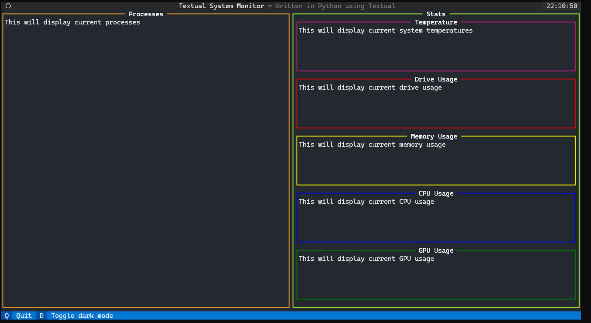

# TextualSystemMonitor

This is intended to be a simple system monitor app created in Textual.

This is a preliminary design, for now.



# Pipenv

This system uses Pipenv. Install with

```shell
$ pip install --user pipenv
```

# Getting Started

Clone with

```shell
$ git clone https://github.com/BlackSound1/textual-system-monitor.git &&
  cd textual-system-monitor
```

Run the app with

```shell
$ pipenv run python src/main.py
```
