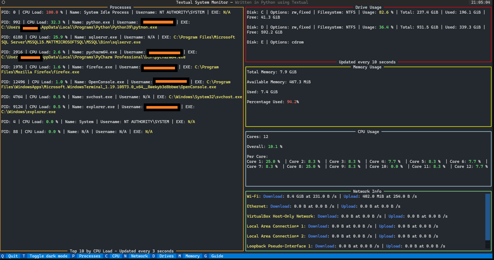

# Textual System Monitor

This is intended to be a system monitor app created in Python, using Textual.

It is only guaranteed to work in Windows. There are currently no plans to offer support for other 
operating systems, as different OSes have different low-level APIs for system information.


This is the main page, where you can see live-updating readouts for all system stats:



**Note**: Personal info has been censored, the orange bars are not present in the real app.

# Features

- All information live-updates. Some information, like the Processes, updates slowly to be more performant.
  Other information, like CPU load, updates multiple times a second.
- Percentages (indicating load) are color-coordinated according to certain thresholds.
  High percentages are <span style="color: red;">red</span>, medium percentages are
  <span style="color: yellow;">yellow</span>, and low percentages are <span style="color: green;">green</span>.
- Quantities of bytes are automatically shown in human-readable formats, such as KiB and GiB.
- If the window is too small, all panes have vertical scroll bars, such as the one in the
  Processes section in this screenshot.
- At any time, press `q` to exit the app. `Crtl-C` also works.
- At any time, press `t` to toggle dark mode. The app is designed with dark mode in mind, and it's the default.
  Light mode is unfinished and is a low priority.
- In-app Guide screen.
- Each system stat has its own dedicated page that can be seen with by hitting the corresponding key, or by clicking
  the corresponding pane in the main screen.
- Footer, which always show what keys can be pressed and what they do.
- Header, which shows a clock.

Check out [Exmaples.md](Examples.md) for a guide on each screen.

# Main Page Overview

The main page is the page that is shown when the app first starts, and is the one in the above screenshot. It has
simple views for all system stats.

## Processes

The left-hand side shows information about current processes on the system. Shows the top 10 heaviest processes,
as sorted by CPU load. 

## Stats

The right-hand side shows various system stats.

- **Drive Usage**: Shows info on the current drives on your system. Includes both storage and media drives.
- **Memory Usage**: Shows the current status of the system's memory.
- **CPU Usage**: Shows the current load of each of the systems cores, as well as overall CPU load.
- **Network Info**: Shows the status of each connected network interface.

# Assumptions

- To use this app, I assume you're on Windows.
- You have Python >= 3.9.
- Your distribution of Python has Pip installed.
- You have Make installed. It's possible to get Make on Windows.
  [Read here](https://stackoverflow.com/questions/32127524/how-to-install-and-use-make-in-windows).
  - If you don't have Make installed, then whenever I invoke a `make` command here, look for it in the `Makefile`, and
    run those commands directly (make sure to not run the commands with the '`@`' I add).
- You run `make` or `pipenv` commands from within the Pipenv shell. Not doing so may cause the commands to not work.

# Pipenv

This app uses Pipenv as its virtual environment and package manager. Install with:

```shell
pip install --user pipenv
```

*Note*: If you don't want to use Pipenv, a `requirements.txt` file has been provided. It should be possible to install 
all dependencies with that.

# Getting Started

Clone with:

```shell
git clone https://github.com/BlackSound1/textual-system-monitor.git &&
  cd textual-system-monitor
```

Install dependencies with:

- ```shell
  pipenv install
  ```
  or
- ```shell
  pip install -r requirements.txt
  ```

Run the app with:

```shell
make run
```

# Make

To see a list of available `make` commands and their uses, use: `make help`.

# Contributing

To develop the app, please fork it, not just clone it.

Install the dependencies (including dev dependencies), with:

```shell
pipenv install --dev
```

Check that all tests pass with:

```shell
make test
```

Lint the Python files with:

```shell
make lint
```

**Note**: The output should be:

```shell
0
0
```

Have 2 terminals open. I use 2 instances of Bash in Windows Terminal. 

- In one instance, navigate to the repo, and run `$ make console` from within the Pipenv shell. 
  This will cause the terminal to create a debug console waiting for an instance of the app to hook into.
  [Read more here](https://textual.textualize.io/guide/devtools/).
- In the other instance, from the repo directory, run the dev version of the app with `$ make run-dev` to run the
  app in development mode. The console in the first instance should come to life, with logs from the running app.

More info on `textual console` [here](https://textual.textualize.io/guide/devtools/#console).

When contributing, **always** work from a branch other than `main`. Name your branch something meaningful. Push to your 
own remote branch (because you forked it). Create a pull request from your forked branch into my `main` branch.

# Desired Features

- [x] Make all panels live-update
- [x] Add CPU load info to Processes and sort by highest load
- [ ] Make certain panels searchable as necessary
- [x] Make panels clickable to open a new screen showing more info
- [ ] Add GPU info
- [ ] Add temperature info
- [x] Improve colors, so dark mode toggling looks better
- [x] Lay out information in a nicer, less cluttered way
- [ ] Add support for Linux and MacOS
- [x] Make all command-line duties possible in `make`
