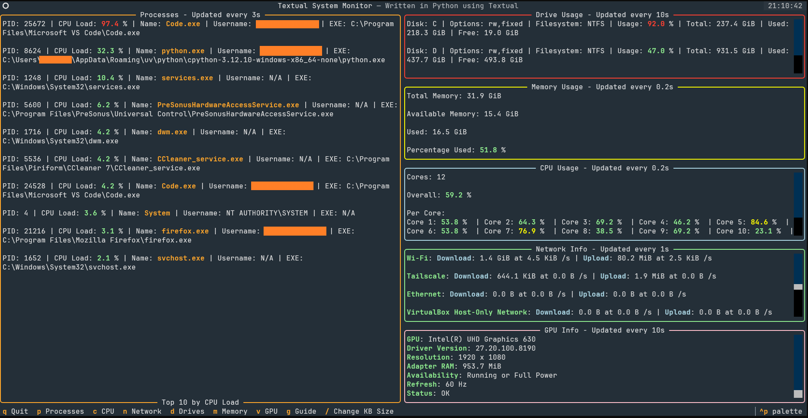

# Textual System Monitor

A beautiful system monitoring terminal app created in Python, using Textual.

This is the main page, where you can see live-updating readouts for all system stats:



**Note**: Personal info has been censored. Screenshot from Windows.

# Getting Started

This is a terminal app, so you should have a terminal to use and knowledge of how to use it.

You should have Python >= 3.12 and [Pipx](https://github.com/pypa/pipx).

Easily install with Pipx because this is a standalone package not
intended to be used in a larger app.

```sh
  pipx install textual-system-monitor
```

Run with

```sh
  tsm
```

That's it!

You could probably also install with normal Pip if you wanted to.

# Features

For this project, Windows is a first-class citizen and features are developed with
Windows in mind. It also works on Linux (at least Ubuntu), but GPU information is
not implemented.

- All information live-updates. Some information updates slowly to be more performant. Other information, like CPU load, updates multiple times a second.
- Percentages (indicating load) are color-coordinated according to certain thresholds. High percentages are <span style="color: red;">red</span>, medium percentages are <span style="color: yellow;">yellow</span>, and low percentages are
<span style="color: green;">green</span>.
- Quantities of bytes are automatically shown in human-readable formats, such as KiB and GiB. Can switch a kilobyte to be defined as 1000 bytes (KB) or 1024 bytes (KiB).
- If the window is too small, all panes have vertical scroll bars, such as the one in the Processes section in this screenshot.
- At any time, press `q` to exit the app. `Crtl-C` also works.
- In-app Guide screen.
- Each system stat has its own dedicated page that can be seen with by hitting the corresponding key, or by clicking the corresponding pane on the main screen.
- Footer, which always show what keys can be pressed and what they do.
- Header, which shows a clock.
- Multiple colour themes!

Check out [EXAMPLES.md](EXAMPLES.md) for a guide on each screen.

# Main Page Overview

The main page is the page that is shown when the app first starts and is the one in the above screenshot.
It has simple views for all system stats.

## Processes

The left-hand side shows information about current processes on the system. Shows the top 10 heaviest processes,
as sorted by CPU load. 

## Stats

The right-hand side shows various system stats.

- **Drive Usage**: Shows info on the current drives on your system. Includes both storage and media drives.
- **Memory Usage**: Shows the current status of the system's memory.
- **CPU Usage**: Shows the current load of each system core, as well as overall CPU load.
- **Network Info**: Shows the status of each connected network interface.
- **GPU Info**: Shows the status of the GPU.

# Stack

- Python (language)
- UV (Python environment, package, and version manager)
- Bash (shell. As this is a terminal app, the shell matters. I assume Bash
  throughout the app)
- Textual (framework)
- Pytest (test framework)
- Ruff (linter and formatter)
- Make (build tool/ command runner)
- Just (optional command runner)

# Desired Features

- [x] Make all panels live-update
- [x] Add CPU load info to Processes and sort by the highest load
- [ ] Make certain panels searchable as necessary
- [x] Make panels clickable to open a new screen showing more info
- [x] Add GPU info
- [ ] Add temperature info
- [ ] Add support for Linux
- [ ] Add support for macOS
- [x] Make all command-line duties possible in `make`
- [x] Add the ability to switch between 1000 and 1024-byte kilobytes
