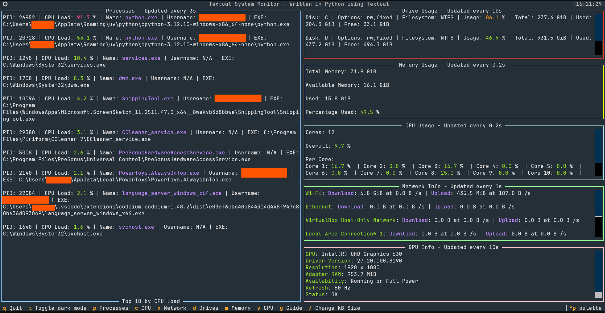

# Textual System Monitor

A beautiful system monitoring terminal app created in Python, using Textual.

This is the main page, where you can see live-updating readouts for all system stats:



**Note**: Personal info has been censored, the orange bars are not present in the real app.

# Features

For this project, Windows is a first-class citizen and features are developed with
Windows in mind. It also works on Linux (at least Ubuntu), but GPU information is
not implemented.

- All information live-updates. Some information updates slowly to be more performant. Other information, like CPU load, updates multiple times a second.
- Percentages (indicating load) are color-coordinated according to certain thresholds. High percentages are <span style="color: red;">red</span>, medium percentages are <span style="color: yellow;">yellow</span>, and low percentages are
<span style="color: green;">green</span>.
- Quantities of bytes are automatically shown in human-readable formats, such as KiB and GiB. Can switch a kilobyte to be defined as 1000 bytes (KB) or 1024 bytes (KiB).
- If the window is too small, all panes have vertical scroll bars, such as the one in the Processes section in this screenshot.
- At any time, press `q` to exit the app. `Crtl-C` also works.
- In-app Guide screen.
- Each system stat has its own dedicated page that can be seen with by hitting the corresponding key, or by clicking the corresponding pane on the main screen.
- Footer, which always show what keys can be pressed and what they do.
- Header, which shows a clock.
- Multiple colour themes!

Check out [EXAMPLES.md](EXAMPLES.md) for a guide on each screen.

# Main Page Overview

The main page is the page that is shown when the app first starts and is the one in the above screenshot.
It has simple views for all system stats.

## Processes

The left-hand side shows information about current processes on the system. Shows the top 10 heaviest processes,
as sorted by CPU load. 

## Stats

The right-hand side shows various system stats.

- **Drive Usage**: Shows info on the current drives on your system. Includes both storage and media drives.
- **Memory Usage**: Shows the current status of the system's memory.
- **CPU Usage**: Shows the current load of each system core, as well as overall CPU load.
- **Network Info**: Shows the status of each connected network interface.
- **GPU Info**: Shows the status of the GPU.

# Requirements

- **A terminal emulator** like Alacritty, Git Bash, GhosTTY, Windows Terminal, Warp,
etc. If you don't have one, then this app won't work for you because it's a
terminal-only app. It *may* be possible to run this in Windows Command Prompt if you
add UV and Make to your `$PATH`, but I haven't tested it.

- **Git**. You need Git to get this code onto your computer to run it. If you don't have Git, get it [here](https://git-scm.com/).

- **UV**. UV is a nice Python version manager, package manager, and 
environment manager. I feel it's the future of Python. It can be used even without 
having Python on your system. In case you don't have it, then you must have CPython
installed separately.

  The version of CPython used is 3.12. Higher is, of course, also possible.

- **Make**. Make is a build tool that can also be used as a command runner (although
it's not designed to be such like Just). Throughout this guide, `make` commands will be used.
In case you don't have Make or can't get it easily, you can just look in the
`Makefile` for that command name and copy-and-paste the actual command(s) it refers
to (without the `@`) into your terminal and run it that way. More complicated,
multi-stage commands like `make install` need to be read carefully to figure out
what actual commands to run in your terminal manually.

  It's possible to get Make on Windows: [Read here](https://stackoverflow.com/questions/32127524/how-to-install-and-use-make-in-windows).


# Getting Started

Clone with:

```shell
git clone https://github.com/BlackSound1/textual-system-monitor.git tsm && \\
  cd tsm
```

If you don't have UV, install dependencies in a local virtual environment using 
Python's own Pip:

```sh
make install
```

If this doesn't work for some reason, `requirements.txt` is provided for
your convenience. Install them however you know how to install
dependencies.

After dependencies are installed (or if you have UV), simply run the app with

```sh
make run
```

# Make

To see a list of available `make` commands and their uses, use:

```sh
make help
```

# Just

As I briefly mentioned earlier, Make is a build tool, not really a command runner. The fact that
Make can be used as a command runner is a useful byproduct of its other abilities.
For a true command runner, I use Just. It's a newer tool that I think is kind of neat.
It's not a requirement for this project because I only have it doing things Make does.

Check it out here: https://just.systems/man/en/introduction.html.

Similar to Make, instead of using `make run`, you would use `just run`, etc.

One of the advantages of Just is that its commands can accept arguments, so I was able to simplify
and condense several of the Make targets into single Just commands. I'm sure there's a way to
simplify my `Makefile` to better resemble the `Justfile`, but Just makes the process quite easy.

# Stack

- Python (language)
- UV (Python environment, package, and version manager)
- Bash (shell. As this is a terminal app, the shell matters. I assume Bash
  throughout the app)
- Textual (framework)
- Pytest (test framework)
- Flake8 (linter)
- Make (build tool/ command runner)
- Just (optional command runner)

# Desired Features

- [x] Make all panels live-update
- [x] Add CPU load info to Processes and sort by the highest load
- [ ] Make certain panels searchable as necessary
- [x] Make panels clickable to open a new screen showing more info
- [x] Add GPU info
- [ ] Add temperature info
- [ ] Add support for Linux
- [ ] Add support for macOS
- [x] Make all command-line duties possible in `make`
- [x] Add the ability to switch between 1000 and 1024-byte kilobytes
